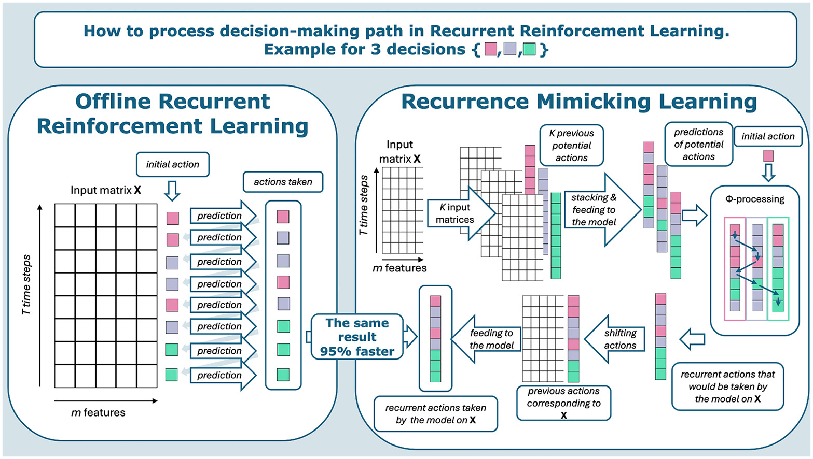

# RML: Recurrence-Mimicking Learning (TensorFlow)

## What is RML?
RML (Recurrence-Mimicking Learning) turns a standard encoder/decoder into a
sequential decision maker by conditioning the decoder on the previous action.
You train it with a reward signal, and it learns to produce action sequences
over time.

## Why it matters
Offline recurrent reinforcement learning typically requires T sequential
rollouts per epoch to build an action trajectory. RML reorganizes this into two
batched passes while preserving the exact recurrent path, which makes training
much faster without giving up global-reward optimization.

## Intuition (two-pass view)
- First pass: evaluate all possible previous actions in parallel.
- Selection: pick the exact recurrence path a step-by-step rollout would take.
- Second pass: keep the trajectory differentiable and optimize the global reward.

## Core implementation
Use the core RML module with any encoder/decoder and any discrete or
quasi-continuous action set.



RML is a recurrence‑mimicking learning scheme that turns a standard encoder/decoder
into a sequential decision maker: the decoder conditions on both the latent
representation and the previous action, and training optimizes a reward signal
through that recurrence.

### What you get
- `RML.py` — model‑agnostic RML core with:
  - `ActionSpace` (discrete or dense grid)
  - `DecisionRule` (argmax / nearest / round / custom)
  - `RML` wrapper (two‑pass RML forward + training step)
  - small MLP builders for quick experiments
- `rml_guide.ipynb` — getting started notebook with 3 ready‑to‑run cases:
  1) trading actions `-1, 0, 1` (sell/hold/buy)
  2) trend prediction with centered rolling labels `-2..2`
  3) quasi‑continuous actions on synthetic data

### When to use this
- you need discrete actions (buy/hold/sell, multi-class decisions)
- you want a quasi-continuous action grid
- you train with a reward or custom objective

### Quick start (5 lines)
```python
import numpy as np
import tensorflow as tf
from RML import ActionSpace, DecisionRule, RML, build_mlp_encoder, build_mlp_decoder

# data
x = np.random.randn(200, 4).astype(np.float32)

# actions
action_space = ActionSpace(values=[-1.0, 0.0, 1.0])
rule = DecisionRule(action_space, mode="nearest")

# models
enc = build_mlp_encoder(input_dim=x.shape[1], hidden=[32, 16])
dec = build_mlp_decoder(
    latent_dim=enc.output_shape[-1],
    action_dim=action_space.K,
    hidden=[16],
    output_dim=1,
    output_activation="tanh",
)

rml = RML(enc, dec, action_space, decision_rule=rule)
```

Open the getting started notebook for full examples:
`rml_guide.ipynb`

Reference paper (sciencedirect):
```text
https://www.sciencedirect.com/science/article/abs/pii/S0925231226002043
```
DOI:
```text
10.1016/j.neucom.2026.132807
```

## Archive / legacy experiments
- `experiments/` — original experiments (e.g.  `ti_augment/`, `transaction_cost/`)
- `experiment.py`, `train.py`, `get_data.py` — legacy experiment runner pipeline
- `model.py`, `model_classifier.py`, etc. — older model variants used in experiments
- `notebooks/` — analysis and diagnostics notebooks

If you are reproducing old runs, keep using the legacy scripts and configs as-is.

## Assumptions / fit
- Offline setting: observations are fixed and do not depend on the learned actions during training.
- If actions materially change future observations, the RML equivalence to step-by-step rollouts no longer holds.
